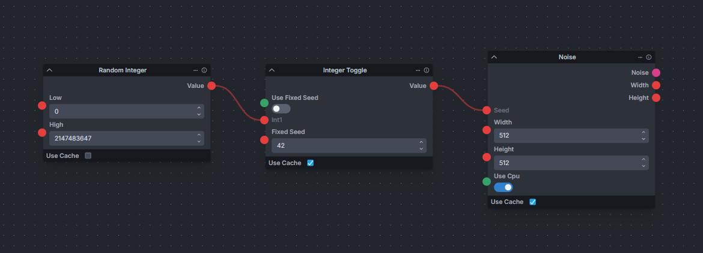

# Stretch's Node Stash

A random collection of nodes for [InvokeAI](https://github.com/invoke-ai/InvokeAI)

## Install

- Manual
    - Hit the green Code button above and select Download ZIP.
    - Once downloaded extract the stretchs_node_stash folder in your invokeai/nodes folder.
    - Restart Invoke
- Git
    - Open a terminal/command prompt in the invokeai/nodes directory
    - enter `git clone https://github.com/TheCulprit/stretchs_node_stash.git`

## Node Breakdown

### Toggles

- `Integer Toggle` - Takes two integer inputs and allows the user to decide which is used based on a toggle.
- `Integer Collection Toggle` - Same as above but for Integer Collections.
- `String Toggle` - Same as above but for Strings.
- `String Collection Toggle` - Same as above but for String Collections.
- `Bool Toggle` - For Booleans.
- `Bool Collection Toggle` - For Boolean Collections.
- `Float Toggle` - For Floats.
- `Float Collection Toggle` - For Float Collections.
- `Image Toggle` - For Images.
- `Image Collection Toggle` - For Image Collections.
- `LoRA Toggle` - For LoRAs
- `LoRA Collection Toggle` - For LoRA Collections
- `Scheduler Toggle` - For Schedulers.
- `Model Toggle` - A generic model toggle. For input use ModelIdentifier node. Warning: All models will be selectable. Ensure the input models are of the same type and are output to something that can use that type or Invoke will throw errors.
- `SDXL Main Model Toggle` - Same as above but only for SDXL main models so much easier/safer to use.

### Name Grabbers

- `Model Name Grabber` - A little awkward but takes input from a Model Identifier node and outputs the model's name.
- `LoRA Name Grabber` - Same as above but only for LoRAs. 

### LoRA Tools

- `LoRA Collection From Path` - Returns a collection of nodes that have a partial match to the given path. (Mostly useful if your loras are stored on disk in a categorised directory structure)
- `Lookup LoRA Triggers` - Takes input from a LoRA Selector node and outputs the trigger phrases that are defined for that LoRA in the model manager.
- `Lookup LoRA Collection Triggers` - Same as above but for a whole collection of LoRAs. Outputs all triggers as string collection.
- `Random LoRA Mixer` - Takes a collection of LoRAs and returns a new, random collection based on the various input values.
- `Merge LoRA Collections` - Takes two collections of LoRAs and merges them into one Collection.
- `Reapply LoRA Weight` - Allows the setting of a LoRA's weight after it has been selected.

### String Tools

- `String Collection Joiner` - Takes in a Collection of of strings and returns a single string with all the entries separated by the given delimeter.
- `Load Text File To String` - Loads a file at the given path as a string and outputs it.
- `Load All Text Files In Folder` - Loads all files in the given directory which have the given extension as strings and returns them as a Collection of strings.
- `Merge String Collections` - Takes two collections of strings and merges them into one Collection.

### Misc

- `Random Aspect Ratio` - Selects a width & height between a suplied min & max aspect ratio that is appropriate for the supplied base model

### Debug Tools

- `Print String to Console` - Just prints the input string to the console in the selected colour combination. (Useful for quickly debugging string manipulations.)

### Compares
- `Compare Int` - Compares two integer inputs based on a user selected method and outputs a bool depending on the result. Includes greater than, less than, equal to and not equal to
- `Compare Float` - Same as above for floats
- `Compare String` - Same as above for strings. Includes equals, contains, starts with and ends with. Has an extra toggle to ignore case if required.

### Tracery

- `Tracery` - Implement's Kate Compton's [Tracery](http://tracery.io/) as an Invoke node. 
    - Tracery is a simple grammar system which can replace #tokens# with random elements from a given grammar.
    - Grammars are input as a collection of JSON strings which will be merged. Any duplicate grammar entries may be lost. 
    - The given prompt will be expanded and it's #tokens# replaced with random entries from the grammar. 
    - Example Grammar:
        ```json
        {
            "subject": [ "young woman", "old woman", "small puppy"],
            "food": [ "#main_course#", "#dessert#" ],
            "main_course": [ "steak and potatoes", "burger and fries", "spaghetti" ],
            "dessert": [ "ice cream", "chocolate bar", "nachas" ]
        }
    - Example Prompt:
        ```
        A photograph of #subject# eating #food#
    - Example Output:
        ```
        A small puppy eating burger and fries
    - Modifiers:
        - Modifers can be applied to tokens to vary the output by writing a `.` and the name of the modifier after the token. `#token.modifier#`. If a modifier takes arguments they go in brackets after the modifier name. `#token.modifier(argument1,argument2)#`
        - Available modifiers
            - ran - *Will only add the exapanded text to the output if a random chance is met*
                - Random chance must be given as an integer value out of 100
                - Usage: `#token.ran(50)#` for a 50 percent chance. 
            - replace - *Replaces some of the expanded output*
                - Usage: `#token.replace(thin,fat)` will replace any instance of `thin` in the expanded output with `fat`
        - If the resulting expanded text contains your token as `((token))` then it failed to find that token in the grammar and there may be an issue with your grammar.
        - This node implements [Tracery](http://tracery.io/) by Kate Compton, using code from the [Python version](https://github.com/aparrish/pytracery) by Allison Parrish.

## Examples
Integer Toggle to toggle between a random or fixed seed.



Grabbing the name from a model.


Merging LoRA Collections.


Looking up trigger phrases for a LoRA


Adding LoRAs to a Random LoRA Mixer


Selecting LoRAs for the LoRA mixer using LoRA Collections from Path and inserting the trigger phrases into the prompt.


Simplest Tracery example.


Loading Tracery grammars from a directory.


## Changelog
- Added extension selection to LoadAllTextFilesInFolder
- Fixed Tracery modifiers that were a waste of time
- Added MergeStringCollections node
- Fixed LoadTextFileToString using cache by default
- Added RandomSDXLDimensions node
- Fixed issue with Tracery randomisation
- Added LookupLoRACollectionTriggers node
- Removed RandomSDXLDimension and replaced with the base model agnostic RandomAspectRatio node.
- Fixed issue with LookupLoRACollectionTriggers not outputting the string collection correctly.
- Selector node names changed to Toggle to avoid a namimg conflict with core nodes.
- Extended toggle nodes to all primitives and a few extra.
- Added some compare nodes for int, float and string.

## License
This port uses code from the python port of Tracery by Allison Parish and therefore inherits the Apache License 2.0

```
    Tracery node Based on code by Allison Parrish and Kate Compton

    Licensed under the Apache License, Version 2.0 (the "License");
    you may not use this file except in compliance with the License.
    You may obtain a copy of the License at

        http://www.apache.org/licenses/LICENSE-2.0

    Unless required by applicable law or agreed to in writing, software
    distributed under the License is distributed on an "AS IS" BASIS,
    WITHOUT WARRANTIES OR CONDITIONS OF ANY KIND, either express or implied.
    See the License for the specific language governing permissions and
    limitations under the License.`